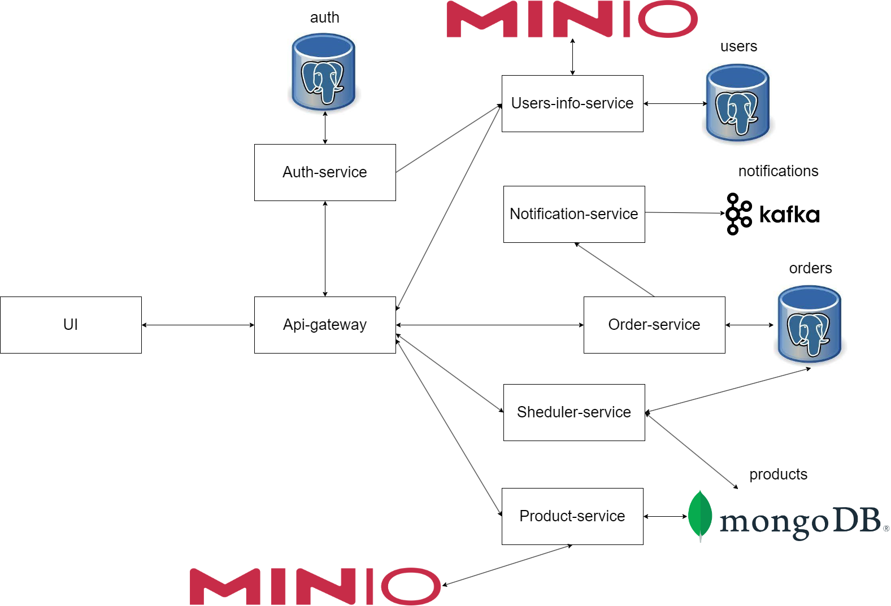

# CarBuy
CarBuy - это микросервисное приложение, которое представляет собой платформу для продажи/покупки
автомобилей. Пользователи могут просматривать доступные для покупки автомобили, а так же
продавать свои.

# Использованные технологии 
Spring Boot, Spring Cloud, Spring Security, Spring Scheduler, JWT token, Spring Data, PostgreSQL, MongoDB, Minio,
Apache kafka, Thymeleaf, Docker, Flyway, Микросервисная архитектура.

# Архитектура

# UI
Сервис используется для отображения thymeleaf шаблонов, и отображает актуальную информацию,
полученную с других микросервисов.

# Api-gateway
Служит универсальным способом взаимодействия микросервисов, обеспечивает load balancing.

# Auth-service
Сервис ответственнен за регистрацию и аутентификацию пользователей. При входе в систему 
пользователю выдается jwt токен, который используется далее для взаимодействия с приложением.

# Users-info-service
Вспомогательный сервис, который хранит подробную информацию о пользователе, указанную при
регистрации. Эта информация используется для того, чтобы человек, который собирается купить 
машину, мог посмотреть информацию о продавце.

# Product-service
Сервис хранит подробную информацию об автомобилях, в том числе ссылку на изображение автомобиля
, которое хранится в файловом хранилище Minio. Фактически реализуется CRUD функционал над
сущностью product(объект-автомобиль). Вся информация хранится в MongoDB.

# Order-service
Сервис хранит состояние заказов, то есть, если человек решил купить автомобиль, то в таблице
orders появляется запись, которая хранит информацию об участниках сделки, айди автомобиля,
дата сделки, и статус сделки. Здесь стоит подробнее поговорить о статусе сделки. Он может
принимать три значения: null, true, false. Если сделка еще не подтверждена владельцем, то 
статус null, если подтверждена - true, иначе - false. Подробно про установку статуса смотри
Notification-service. После создания заказа отправляется асинхронный запрос в Notification-service.

# Notification-service
Этот сервис, с помощью kafka, ловит топик notification из Order-service(заказ на покупку авто)
, и отправляет владельцу автомобиля уведомление, что такой то пользователь хочет приобрести
у него такой то автомобиль. Владелец может либо подтвердить сделку, либо отказаться от нее,
соответсвенно, стасут сделки в orders станет либо true, либо false. В первом случае считается, что 
сделка состоялась, а во втором - нет. Далее в дело вступает Scheduler-service.

# Scheduler-service
Сервис активируется каждый день в полночь. Его задача в том, чтобы очистить неактуальные данные
из Product-service и Order-service. Если в orders в каком либо заказе статус стоит true,
значит, автомобиль был успешно продан, и информацию об автомобиле из products и о самом заказе
в orders можно удалить. Понятно, что в коммерческом проекте эту информацию не стоит удалять,
поскольку она очень даже полезна для аналитиков, но, в данном проекте, не вижу смысла ее хранить.
Если статус false, то удаляется только запись из orders, ведь автомобиль еще не продан. В случае 
если статус null - ничего не происходит, владелец не успел принять решение.

